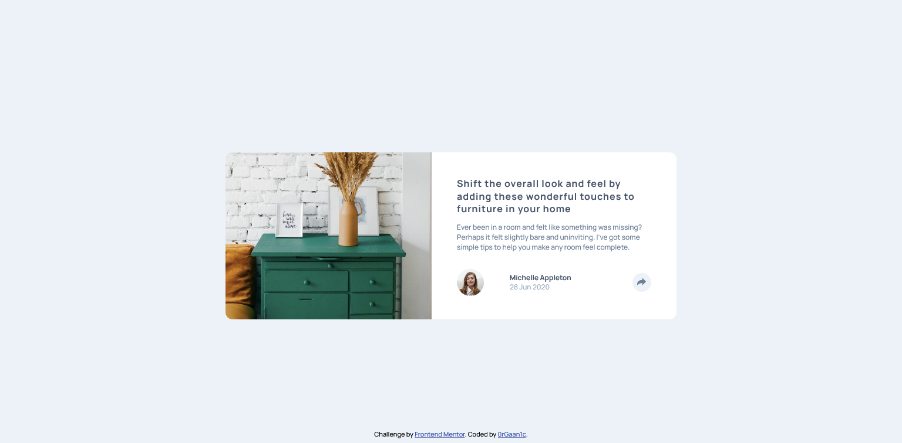
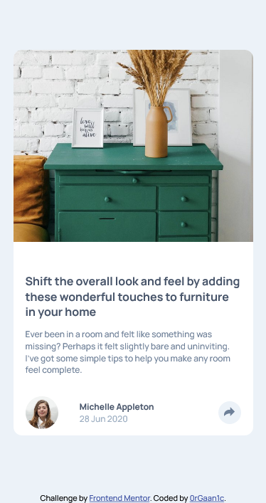

# Frontend Mentor | Article preview component

This is a solution to the [Frontend Mentor | Article preview component](https://www.frontendmentor.io/challenges/article-preview-component-dYBN_pYFT). Frontend Mentor challenges help you improve your coding skills by building realistic projects.

## Table of contents

- [Overview](#overview)
  - [The challenge](#the-challenge)
  - [Screenshot](#screenshot)
  - [Links](#links)
- [Built with](#built-with)
- [Author](#author)

**Note: Delete this note and update the table of contents based on what sections you keep.**

## Overview

### The challenge

Users should be able to:

- View the optimal layout depending on their device's screen size

### Screenshot

- Desktop

  

- Mobile

  

### Links

- [Solution URL](https://github.com/0rGaan1c/FrontEndMentor_Challenges/tree/main/article-preview-component)
- [Live Site URL](https://previewcomponent.netlify.app/)

### Built with

- HTML, CSS
- Mobile-first Workflow

## Author

- Frontend Mentor - [@0rGaan1c](https://www.frontendmentor.io/profile/organic-042)
- Twitter - [@0rGaan1c](https://www.twitter.com/0rGaan1c)
