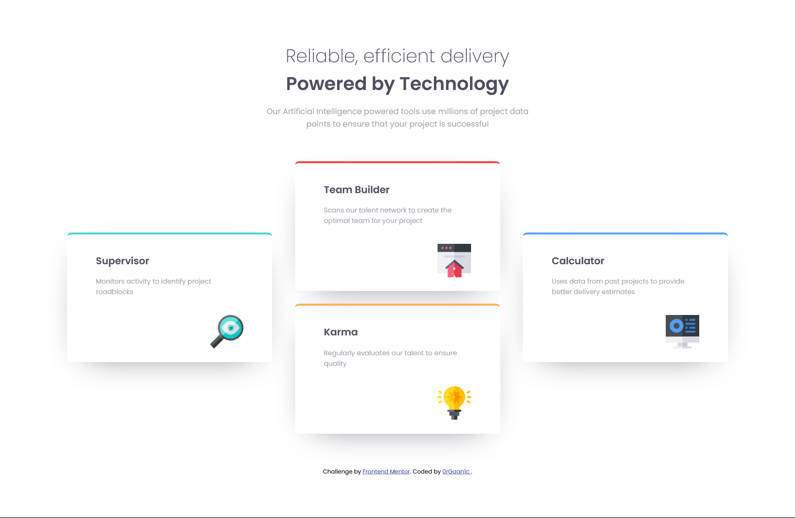
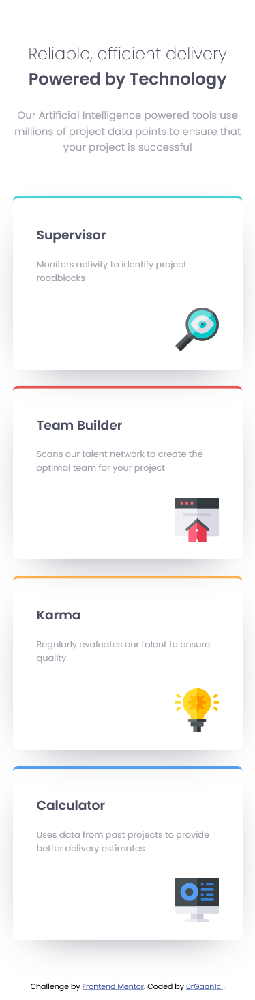

# Frontend Mentor - Sunnyside agency landing page solution

This is a solution to the [Four card feature section](https://www.frontendmentor.io/challenges/four-card-feature-section-weK1eFYK). Frontend Mentor challenges help you improve your coding skills by building realistic projects.

## Table of contents

- [Overview](#overview)
  - [The challenge](#the-challenge)
  - [Screenshot](#screenshot)
  - [Links](#links)
- [My process](#my-process)
  - [Built with](#built-with)
- [Author](#author)

**Note: Delete this note and update the table of contents based on what sections you keep.**

## Overview

### The challenge

Users should be able to:

- View the optimal layout for the site depending on their device's screen size
- See hover states for all interactive elements on the page

### Screenshot

- Desktop

- Mobile

### Links

- [Solution URL](https://github.com/0rGaan1c/FrontEndMentor_Challenges/tree/main/four-card-feature-section)
- [Live Site URL](https://four-card-feature-section-organic.netlify.app/)

## My process

### Built with

- HTML5
- SCSS
- Flexbox
- Mobile-first workflow

## Author

- Frontend Mentor - [@0rGaan1c](https://www.frontendmentor.io/profile/organic-042)
- Twitter - [@0rGaan1c](https://www.twitter.com/0rGaan1c)
