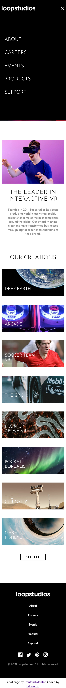

# Frontend Mentor - Testimonials grid section solution

This is a solution to the [Loopstudios landing page challenge hub](https://www.frontendmentor.io/challenges/loopstjjudios-landing-page-N88J5Onjw). Frontend Mentor challenges help you improve your coding skills by building realistic projects.

## Table of contents

- [Overview](#overview)
  - [The challenge](#the-challenge)
  - [Links](#links)
  - [Screenshot](#screenshot)
- [My process](#my-process)

  - [Built with](#built-with)
  - [Useful resources](#useful-resources)

- [Author](#author)

## Overview

### The challenge

Users should be able to:

- View the optimal layout for the site depending on their device's screen size
- See hover states for all interactive elements on the page

### Links

- [Solution URL](https://github.com/0rGaan1c/FrontEndMentor_Challenges/tree/main/loopstudios-landing-page)
- [Live Site URL](https://loopstudios-landing-page-organic.netlify.app/)

### Screenshot

- Desktop

- Mobile

## My process

### Built with

- HTML5
- SCSS
- Grids
- Flexbox
- Mobile-first workflow

### Useful resources

- [Stack Overflow](https://stackoverflow.com/questions/9182978/semi-transparent-color-layer-over-background-image) - Learned how to add transparent color layer over background image using box-shadow.

## Author

- Frontend Mentor - [@0rGaan1c](https://www.frontendmentor.io/profile/organic-042)
- Twitter - [@0rGaan1c](https://www.twitter.com/0rGaan1c)
