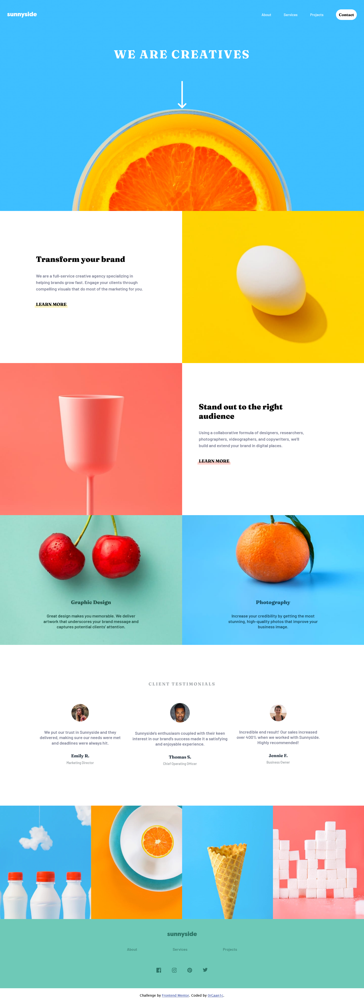
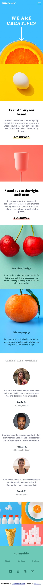

# Frontend Mentor - Sunnyside agency landing page solution

This is a solution to the [Sunnyside agency landing page challenge on Frontend Mentor](https://www.frontendmentor.io/challenges/sunnyside-agency-landing-page-7yVs3B6ef). Frontend Mentor challenges help you improve your coding skills by building realistic projects.

## Table of contents

- [Overview](#overview)
  - [The challenge](#the-challenge)
  - [Screenshot](#screenshot)
  - [Links](#links)
- [My process](#my-process)
  - [Built with](#built-with)
  - [Useful resources](#useful-resources)
- [Author](#author)

**Note: Delete this note and update the table of contents based on what sections you keep.**

## Overview

### The challenge

Users should be able to:

- View the optimal layout for the site depending on their device's screen size
- See hover states for all interactive elements on the page

### Screenshot

- Desktop

- Mobile

### Links

- [Solution URL](https://github.com/0rGaan1c/FrontEndMentor_Challenges/tree/main/sunnyside-agency-landing-page#my-process)
- [Live Site URL](https://sunnyside-agency-landing-page-organic.netlify.app/)

## My process

### Built with

- HTML5
- CSS
- Flexbox
- Mobile-first workflow

### Useful resources

- [StackOverflow](https://stackoverflow.com/questions/6910049/on-a-css-hover-event-can-i-change-another-divs-styling) - I was able to change the styling of another element while hovering over a differnt element.
- [StackOverflowk](https://stackoverflow.com/questions/10844205/html-5-strange-img-always-adds-3px-margin-at-bottom) - Images were always adding some margin on bottom, I fixed this issue with the help of this resource.

## Author

- Frontend Mentor - [@0rGaan1c](https://www.frontendmentor.io/profile/organic-042)
- Twitter - [@0rGaan1c](https://www.twitter.com/0rGaan1c)
