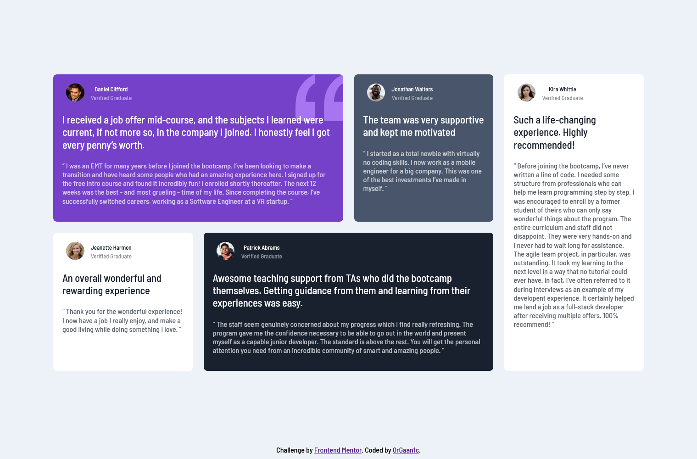

# Frontend Mentor - Testimonials grid section solution

This is a solution to the [Testimonials grid section challenge on Frontend Mentor](https://www.frontendmentor.io/challenges/testimonials-grid-section-Nnw6J7Un7). Frontend Mentor challenges help you improve your coding skills by building realistic projects.

## Table of contents

- [Overview](#overview)
  - [The challenge](#the-challenge)
  - [Links](#links)
  - [Screenshot](#screenshot)
- [My process](#my-process)

  - [Built with](#built-with)
  - [What I learned](#what-i-learned)
  - [Useful resources](#useful-resources)

- [Author](#author)

## Overview

### The challenge

Users should be able to:

- View the optimal layout for the site depending on their device's screen size
- See hover states for all interactive elements on the page

### Links

- [Solution URL]()
- [Live Site URL]()

### Screenshot

- Desktop

- Mobile

## My process

### Built with

- HTML5
- SCSS
- Grids
- Mobile-first workflow

### What I learned

I learned about CSS Grids while doing this challenge.

### Useful resources

- [Grid Tutorial](https://www.youtube.com/watch?v=68O6eOGAGqA&t=662s) - This is a really good tutorial on CSS Grids. It helped me in understanding CSS Grids when I was struggling with it.
- [Grid Garden](https://cssgridgarden.com/) - It's a very good resource to learn and pratice CSS Grids.

## Author

- Frontend Mentor - [@0rGaan1c](https://www.frontendmentor.io/profile/organic-042)
- Twitter - [@0rGaan1c](https://www.twitter.com/0rGaan1c)
